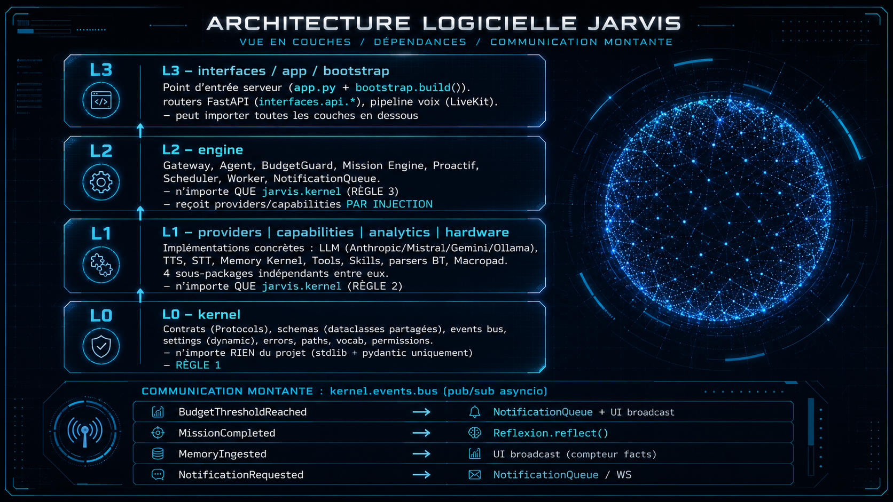

<div align="center">

# Jarvis OS

[](https://github.com/Grominet95/jarvis-OS)
[](https://github.com/Grominet95/jarvis-skills)

[](https://python.org)
[](https://fastapi.tiangolo.com)
[](https://livekit.io)
[](https://anthropic.com)
[](LICENSE)

Assistant personnel IA, texte & voix temps réel, self-hosted, stack open source.


</div>

---

## C'est quoi ?

Jarvis est un assistant personnel IA qui tourne en local. Il expose un serveur FastAPI qui gère à la fois une interface de chat texte et un pipeline vocal temps réel (via LiveKit). Il se connecte au LLM de ton choix, mémorise les conversations, utilise des outils (recherche web, Gmail, Google Calendar, Spotify, vision, exécution de code…) et fait tourner des tâches proactives en arrière-plan (alertes météo, digests d'actualités, etc.).

**Fonctionnalités principales :**

- Pipeline vocal temps réel : STT (Whisper/Deepgram) + LLM + TTS (Piper/ElevenLabs), bridgé via LiveKit
- Mémoire vivante (Memory Kernel) : faits atomiques datés, sourcés, renforçables, oubliables, corrigeables — SQLite source de vérité, miroir Markdown lisible
- Mission Engine : transforme une demande en mission planifiée, vérifiée à chaque étape (structurelle, déterministe, sémantique), reprise après crash
- Gouvernance transversale : tout ce qui touche au filesystem ou au réseau passe par un gate composite (risque × catégorie × budget) avec audit immuable
- Apprentissage : leçon post-mission, Skill Lab (skills nées de l'usage, testées en sandbox Docker, validées par l'humain avant install), Capability Engine pour combler les manques de capacité
- Proactif gouverné : initiatives à niveau d'autonomie 0-5, Command Center pour les piloter, Curator nocturne qui fait l'entretien (facts/skills/coûts)
- Utilisation d'outils : navigateur, Gmail, Calendar, Notion, Spotify, runner CLI, filesystem, vision (YOLOv8), météo
- Multi-LLM : Anthropic Claude, Mistral, Google Gemini, ou modèles Ollama en local
- UI d'administration : dashboard web, widget globe, Command Center, Skill Lab

---

## Architecture — couches strictes (CDC §2)

Depuis la migration `refonte/architecture-couches` (v0.2), le code est
organisé en **4 couches strictes** validées par
[import-linter](https://pypi.org/project/import-linter/) en CI. Chaque
règle est exécutable, pas juste de la convention.



| Couche | Package | Rôle |
|---|---|---|
| **L0** | `kernel/` | `contracts.py` (Protocols), `schemas.py` (dataclasses partagées), `events.py` (bus pub/sub), `settings.py`, `errors.py`, `vocab.py`, `paths.py`, `permissions.py`, `approval.py`, `notifications.py` |
| **L1** | `providers/` | LLM (`llm/api.py`, `local.py`, `factory.py`), Memory Kernel SQLite (`memory/kernel.py`, `ingest.py`, `mirror.py`, `search.py`), TTS/STT (`audio/`), Vision (`vision/`), AutoDream + ConsolidationAgent + CrossSessionRecall |
| **L1** | `capabilities/` | Tools (browser, Gmail, Calendar, Notion, Spotify, vision, filesystem, CLI, memory…), Skills (`registry.py`, `lifecycle.py`, `lab.py`, `synthesizer.py`, `executor.py`) |
| **L1** | `analytics/`, `hardware/` | Widgets analytics (YouTube, projets, etc.), Macropad 2 touches, parsers Bluetooth |
| **L2** | `engine/` | Gateway, Agent, Router, SessionManager (composition orchestrale), BudgetGuard, UsageTracker, Mission Engine (`mission/orchestrator.py`, `worker_agent.py`, `verifier.py`, `governance.py`, `reflexion.py`, `capability_engine.py`), Proactif (`proactive/engine.py`, `command_center.py`, `curator.py`, collectors), Background (`background/worker.py`, `scheduler.py`, `notifications.py`) |
| **L3** | `interfaces/`, `app.py`, `bootstrap.py` | `bootstrap.build()` = composition root unique (instancie ~30 objets, câble le bus, vérifie isinstance Protocols), `app.py` (point d'entrée API), `interfaces/api/*.py` (routers FastAPI : chat, budget, memory, proactive, skills, config/{settings,llm,devices,permissions}, sessions, vision, system, …), `interfaces/voice/agent.py` (pipeline voix LiveKit) |

**Garde-fous permanents** (CI lane rapide, à chaque push) :

| Gate | Vérifie |
|---|---|
| `ruff check` | Style + erreurs Python (règles `E W F I B UP ANN ASYNC TID`) |
| `lint-imports` | 3 contrats `forbidden` qui encodent les RÈGLES 1/2/3 ci-dessus |
| `mypy` scopé | Conformité des implémentations aux Protocols `kernel.contracts` |
| `pytest -m "not integration"` | Suite unitaire (~587 tests, < 30s) |
| `snapshot_routes.py` diff | Les URLs HTTP n'ont pas dévié de la baseline |

La lane lourde (CI déclenchée sur `main` + scheduled hebdo) installe les
deps système (`cmake`, `openblas`, `portaudio`, `libgl1`) et lance la
suite complète, incl. les ~28 tests `@pytest.mark.integration`.

---

## Prérequis

| Outil | Version | Notes |
|---|---|---|
| Python | 3.11+ | |
| [uv](https://docs.astral.sh/uv/) | latest | Gestionnaire de paquets |
| [LiveKit](https://livekit.io/) | cloud ou self-hosted | Pipeline vocal uniquement |
| Docker | optionnel | Requis par la fonctionnalité code-agent |
| `nowplaying-cli` | optionnel (macOS) | Lecture locale « now playing » — `brew install nowplaying-cli` |

---

## Installation

```bash
git clone https://github.com/Grominet95/jarvis-OS.git
cd jarvis-OS
./jarvis eclosion
```

Le wizard interactif :
1. Vérifie Python 3.11+ et installe `uv` si absent
2. Installe toutes les dépendances Python (`pyproject.toml`)
3. Demande ta clé API Anthropic (seule clé obligatoire)
4. Demande ton prénom (affiché lors du scan biométrique)
5. Configure ta localisation pour le moteur proactif
6. Propose les modules optionnels (ElevenLabs, LiveKit, AISstream)
7. Télécharge les modèles ML (YOLOv8n, Piper TTS)
8. Génère le `.env` et installe la commande `jarvis` globalement

> La première fois, utilise `./jarvis eclosion`. Le wizard installe ensuite la commande globalement, tu peux utiliser `jarvis` depuis n'importe où.

---

## Démarrage

```bash
jarvis run      # serveur principal  →  localhost:8000/admin
jarvis voice    # pipeline vocal LiveKit (optionnel)
```

Les deux peuvent tourner simultanément : le voice agent délègue au gateway du serveur principal, donc ils partagent la même session, la même mémoire et les mêmes outils.

---

## Configuration

Tout est configuré pendant l'éclosion. Pour modifier une clé après coup, édite `.env` à la racine du projet.

**Intégrations Google (Gmail / Calendar) :** place ton `credentials.json` issu de Google Cloud Console dans `config/google_credentials.json`, puis démarre Jarvis — il ouvrira le flux d'authentification OAuth et sauvegardera les tokens en local (ils sont gitignorés).

**Reconnaissance faciale (séquence Wake Up) :** pour que le scan biométrique te reconnaisse, place une photo de toi (format JPG, visage bien visible, bonne luminosité) dans :

```
vision/faces/référence.jpg
```

Sans cette photo, la séquence de scan s'exécute mais retourne toujours "identité non reconnue". Le dossier `vision/faces/` est gitignorés, ta photo ne sera jamais commitée.

---

## Outils disponibles

| Outil | Description |
|---|---|
| `browser` | Recherche web + scraping de pages |
| `gmail` | Lister les emails récents |
| `calendar` | Lister / créer des événements Google Calendar |
| `spotify` | Contrôle de lecture |
| `notion` | Rechercher et lire des pages |
| `weather` | Météo actuelle (Open-Meteo, sans clé API) |
| `vision` | Capture d'écran + détection d'objets YOLOv8 |
| `filesystem` | Lire des fichiers, chercher par pattern |
| `cli` | Lancer des commandes shell whitelistées (configurées dans `config/tools.yaml`) |
| `memory` | Écrire des notes structurées dans le topic store |

---

## Système de mémoire

Jarvis ne mémorise pas en vrac : il **extrait des faits atomiques** (« Barth vise un marathon sub-3h »), les **date**, les **source** (quel échange l'a produit), les **renforce** quand il les ré-entend, les **archive** quand ils sont contredits — sans jamais les supprimer. Une base SQLite unique est la source de vérité ; un miroir Markdown lisible (compatible Obsidian) en donne une vue inerte.

| Table | Ce qu'elle contient |
|---|---|
| `events` | Log immuable de tout ce qui arrive (échanges, observations, leçons de mission) |
| `facts` | Claims atomiques avec prédicat/catégorie issus d'un vocabulaire fermé, statut (`active`/`superseded`/`needs_review`…), confiance, decay par catégorie |
| `fact_observations` | Renforcement sans duplication : chaque ré-observation crée une trace au lieu d'ajouter un doublon |
| `fact_relations` | Liens entre facts (`supersedes`, `contradicts`, `supports`, `related_to`) |

Le miroir Markdown est **unidirectionnel** : la DB génère `user/preferences.md`, `user/projects.md`, `user/goals.md`, `jarvis/persona.md`, etc., pour inspection. Éditer un `.md` ne modifie pas la mémoire — pour corriger un souvenir, Jarvis crée un événement `human_correction` qui met la DB à jour.

Chaque nuit, **AutoDream** + **ConsolidationAgent** repassent sur les sessions récentes pour en extraire les facts manqués en temps réel.

Tout vit dans `memory_data/` (DB `jarvis_memory.db`, vault `topics/` lisible, sessions, conso, initiatives). Le dossier est gitignored — la mémoire reste sur ta machine.

---

## Dashboard Monde (World Monitor)

L'onglet **Intel Monde** de l'interface Jarvis affiche [World Monitor](https://github.com/Grominet95/dashboard_monde), un tableau de bord géopolitique temps réel (globe 3D, flux d'actualités IA, radars financiers, suivi d'infrastructures).

**Prérequis :** Node.js 18+

```bash
git clone https://github.com/Grominet95/dashboard_monde.git
cd dashboard_monde
npm install
npm run dev -- --port 3000
```

Une fois lancé sur `http://localhost:3000`, l'onglet Intel Monde de Jarvis l'affiche automatiquement via iframe. Les deux serveurs peuvent tourner simultanément.

> World Monitor fonctionne sans aucune variable d'environnement pour un usage de base. Des clés API optionnelles (Groq, OpenRouter…) permettent d'activer les fonctionnalités IA avancées, voir le `.env.example` du repo.

---

## Moteur proactif

Jarvis ne « pousse pas juste des notifs » : il **entreprend des initiatives gouvernées**. Chaque initiative porte un déclencheur, un objectif, un coût max (tokens/temps/argent), un niveau d'autonomie (0 = répondre seulement → 5 = publier/payer/contacter, validation humaine obligatoire), et un état suivi en continu.

- **Collectors** (`proactive/collectors/`) — captent les signaux : météo (briefing + alertes sévères), actualités (digest RSS), trackers personnalisables. Étends-les en ajoutant un fichier dans le dossier.
- **Command Center** (`proactive/command_center.py`) — la vue unifiée de toutes les initiatives et missions en cours : objectifs, budgets, permissions, heartbeat, coûts. Jarvis ne « fait pas des trucs », il gère des workstreams.
- **Curator nocturne** (`proactive/curator.py`) — job de maintenance qui produit chaque nuit un rapport et propose des patches : facts ajoutés/contradictoires, skills inutilisées à archiver, prompts qui ont dérivé, coûts du jour, erreurs récurrentes. Il **propose**, l'humain valide pour tout ce qui dépasse le gate (cf. gouvernance).
- **Gouvernance** — toute initiative niveau ≥ 3 (exécution sandboxée), 4 (modification de fichiers projet) ou 5 (publication/paiement/contact) passe par le gate composite avant agir, comme n'importe quel step de mission.

---

## Telegram — accès mobile

Jarvis est accessible depuis n'importe où via un bot Telegram. Même LLM, même mémoire, mêmes outils — juste depuis ton téléphone.

**1. Créer le bot**

Ouvre Telegram → cherche `@BotFather` → `/newbot` → choisis un nom et un username (doit finir par `bot`). BotFather te donne un token.

**2. Récupérer ton user ID**

Cherche `@userinfobot` sur Telegram → envoie n'importe quel message → il te répond avec ton ID numérique.

**3. Configurer le `.env`**

```env
TELEGRAM_BOT_TOKEN=7xxxxxxxxx:AAF...
TELEGRAM_OWNER_ID=123456789
TELEGRAM_ENABLED=true
```

**4. Lancer Jarvis** — les logs affichent `Telegram bot démarré`. Ouvre le chat avec ton bot et envoie `/start`.

**Commandes disponibles**

| Commande | Action |
|---|---|
| `/start` | Message de bienvenue + liste des commandes |
| `/status` | État de tous les composants (Jarvis Doctor) |
| `/initiatives` | Initiatives en attente dans le Command Center |
| `/help` | Aide complète |
| Message libre | Parle à Jarvis normalement |

**Sécurité** : seul ton `TELEGRAM_OWNER_ID` est autorisé. Tout autre compte reçoit `⛔ Accès non autorisé.` et n'est pas traité.

---

## Développement

```bash
# Tests + lint + typecheck en un coup (Makefile)
make test       # uv run pytest -q
make lint       # ruff + lint-imports
make typecheck  # mypy scopé kernel + conformité Protocols

# Détail
uv run pytest -m "not integration" -q   # suite unit rapide
uv run pytest -q                         # suite complète
uv run ruff check
uv run ruff format
uv run lint-imports                      # contrat de couches CDC §2
uv run mypy                              # mypy scopé kernel

# Test LLM manuel
uv run python scripts/test_llm.py --stream
uv run python scripts/test_llm.py --provider mistral

# Validation manuelle des phases [LOCAL] (cf. CDC §0.5)
uv run python scripts/validation/phase{1..6}_real_*.py
```

Documentation architecture détaillée : [`docs/architecture/`](docs/architecture/)
(CDC complet, events bus, ABI skills). Backlog migration et résidus
documentés en [`docs/migration/BACKLOG.md`](docs/migration/BACKLOG.md).

---

## Stack technique

- **Python 3.11** : async / FastAPI / uvicorn
- **Anthropic Claude** (LLM principal) + Mistral / Gemini / Ollama en fallback
- **LiveKit Agents** : pipeline vocal temps réel
- **Deepgram** : STT cloud / **faster-whisper** : STT local
- **Piper** : TTS local / **ElevenLabs** : TTS cloud
- **YOLOv8** (ultralytics) : détection d'objets pour l'outil vision
- **pydantic-settings** : configuration typée
- **loguru** : logging structuré
- **uv** : gestion des dépendances

---

## Star History

[](https://www.star-history.com/?repos=Grominet95%2Fjarvis-OS&type=date&legend=top-left)

---


## Licence

[Proprietary Source License](LICENSE) — © 2026 Barthélemy Houot. All rights reserved.
